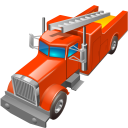

#  Alarm Display 

## Runtime Requirements

- Python 2.6 or 2.7
- [Tesseract](https://code.google.com/p/tesseract-ocr/)

And all libraries specified in
[requirements.txt](https://github.com/whiskeysierra/alarm-display/blob/master/requirements.txt). Which can be
installed using the following command:

    app/setup
 
## Development Requirements

- [homebrew](http://mxcl.github.io/homebrew/)
- [nodejs](http://nodejs.org/)
- [npm](https://npmjs.org/)
- [less](http://lesscss.org/)

To install all required dependencies on a unix-like system run:

    app/dev-setup

Dev-setup installs homebrew, nodejs, npm, tesseract, lessc, all required python libraries,
initializes the database, if needed, and applies pending schema migrations.

## Attributions/Links
The Fire engine Icon by [Aha-Soft](http://www.iconarchive.com/show/transport-for-vista-icons-by-aha-soft/fire-engine-icon.html) is *Free for non-commercial use.*
